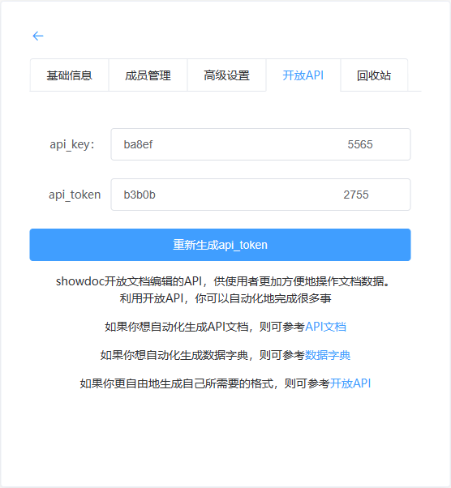

### 关于Maven-Protobuf-Doc

**Maven-Protobuf-Doc**
基于谷歌 **[protoc-gen-doc](https://github.com/pseudomuto/protoc-gen-doc)**
进行的二次Java封装集成，轻松实现解析protobuf文件自动生成api文档接口，插件需结合 **[showdoc](https://www.showdoc.com.cn/)** 文档工具使用，目前仅支持Windows环境下使用，后续持续
更新，陆续推出各平台适配

### 使用教程

#### Maven坐标

```xml

<plugin>
    <groupId>com.hjfruit.plugin</groupId>
    <artifactId>maven-protobuf-doc</artifactId>
    <version>1.0.0-SNAPSHOT</version>
    <configuration>
        <apiHost>${showdoc-server-ip}:${showdoc-server-prot}</apiHost>
        <apiKey>${showdoc-apiKey}</apiKey>
        <apiToken>${showdoc-apiToken}</apiToken>
        <readmePath>${readme-path}</readmePath>
    </configuration>
</plugin>
```

- **apiHost**
    - showdoc服务部署地址：showdoc服务端口
    - 例：192.168.99.99:10000
- **apiKey、apiToken**
    - 进入showdoc操作界面创建项目之后自动生成的信息
    - 
- **readmePath**
    - README.md文件路径（非必须配置），加载README.md当中的内容，建议README.md当中撰写项目迭代变更明细

#### 生成api接口文档


#### 文档预览


